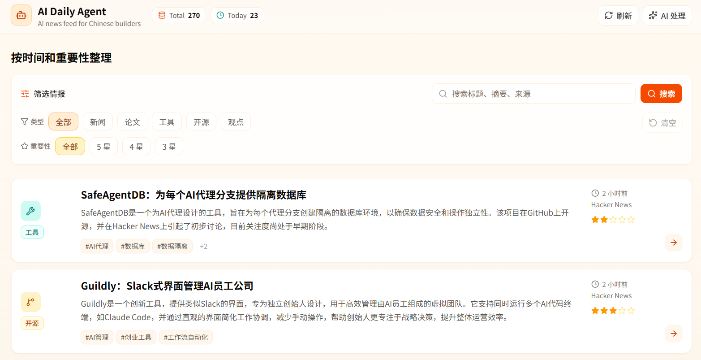
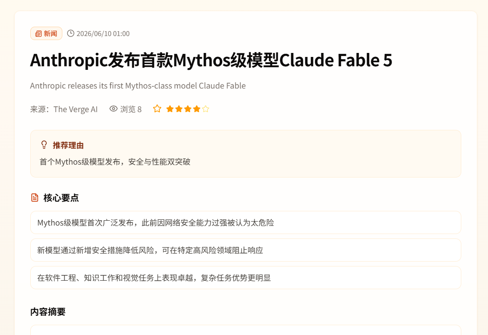
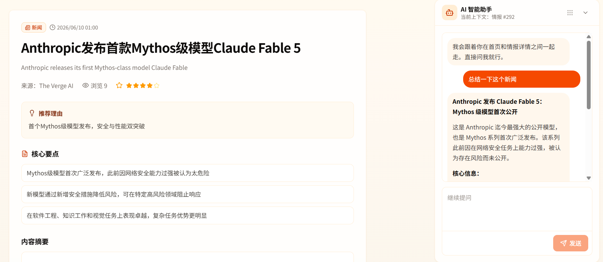
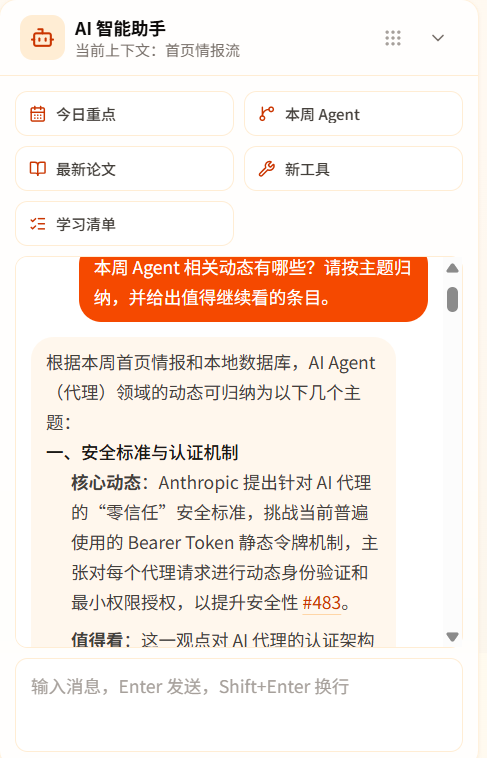
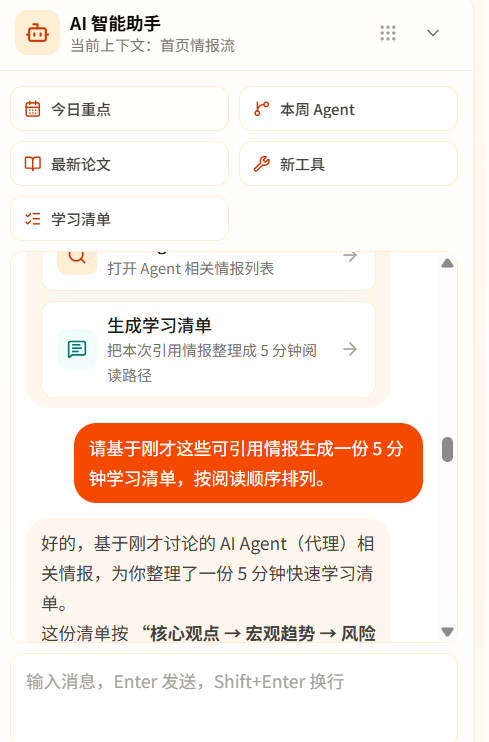

# AI Daily News

AI 驱动的每日情报聚合平台 | AI-powered daily intelligence aggregation platform

[English](#english) | [中文](#中文)

---

## Screenshots

#### Homepage - Intelligence Feed



Browse AI news from multiple sources with smart filtering by category, importance, and keywords.

#### Detail Page - AI-Generated Summary



Each item is processed by LLM to generate Chinese title, summary, key points, and importance rating.

#### AI Assistant - Workbench



Built-in AI assistant can summarize, translate, analyze, and cite the intelligence content with source-backed references.

#### AI Assistant - Quick Intents



Quick intent buttons let users ask for today's highlights, weekly Agent updates, latest papers, new tools, and a short learning checklist without writing a prompt from scratch.

#### AI Assistant - Action Cards



Action cards turn answers into next steps, such as opening a filtered intelligence list or generating a 5-minute learning plan from the cited items.

---

## Quick Start

```bash
# Clone
git clone https://github.com/qingmfh/AI_Daily_News.git
cd AI_Daily_News

# Install
npm install

# Configure (add your API key)
cp .env.example .env.local

# Init database
npm run db:seed

# Run
npm run dev
```

Open [http://localhost:3000](http://localhost:3000)

### Environment Variables

| Variable | Required | Description |
|----------|----------|-------------|
| `OPENAI_API_KEY` | Yes | Your OpenAI-compatible API key |
| `OPENAI_BASE_URL` | Yes | API base URL (e.g., `https://api.openai.com/v1`) |
| `OPENAI_MODEL` | Yes | Model name (e.g., `gpt-4o-mini`) |
| `GITHUB_TOKEN` | No | GitHub token for higher API rate limits |

### Commands

| Command | Description |
|---------|-------------|
| `npm run dev` | Start development server |
| `npm run build` | Build for production |
| `npm run db:seed` | Insert sample data |
| `npm run db:studio` | Open database GUI |

---

## English

An AI-powered daily intelligence aggregation platform that automatically collects, processes, and presents AI-related news, papers, and tools with structured Chinese summaries.

### Features

- **Multi-source Collection** — RSS (TechCrunch, The Verge, VentureBeat, Hacker News, MIT Tech Review), arXiv papers, GitHub trending repos
- **LLM Processing** — Chinese titles, summaries, key points, tags, categories, importance ratings
- **Smart Filtering** — By category, importance, and keywords
- **AI Assistant Workbench** — Quick intents, cited answers, action cards, filtered exploration, and learning checklist generation

### Tech Stack

| Layer | Technology |
|-------|-----------|
| Framework | Next.js 15 + React 19 |
| UI | Tailwind CSS 4 + shadcn/ui |
| Database | SQLite + Drizzle ORM |
| AI | OpenAI-compatible API |

---

## 中文

AI 驱动的每日情报聚合平台，自动采集、处理和展示 AI 相关新闻、论文和工具，生成结构化中文摘要。

### 功能特性

- **多源采集** — RSS 订阅、arXiv 论文、GitHub 热门项目
- **LLM 处理** — 中文标题、摘要、要点、标签、分类、重要度评分
- **智能筛选** — 按分类、重要度和关键词筛选
- **AI 助手工作台** — 支持快捷意图、引用回答、操作卡片、筛选跳转和学习清单生成

### 技术栈

| 层级 | 技术 |
|------|------|
| 框架 | Next.js 15 + React 19 |
| UI | Tailwind CSS 4 + shadcn/ui |
| 数据库 | SQLite + Drizzle ORM |
| AI | OpenAI 兼容 API |

---

## License

MIT License - see [LICENSE](LICENSE) for details.
